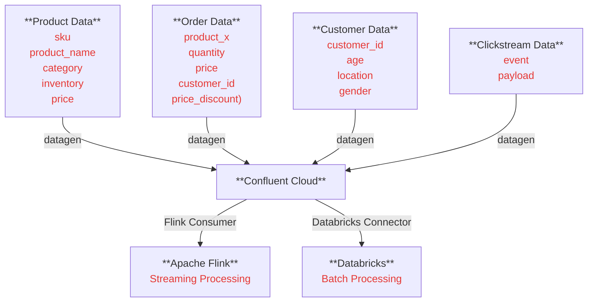

# data-pipeline-recommendation

## Goal

- Build a multi-modal data pipeline with an AI model and inference endpoint for
  the ecommerce domain.
- Hyper-personalization: Based on who the user is, and their prior order history,
  show relevant products
- Achieve this using:
  ○ Confluent Cloud (Kafka)
  ○ Databricks

## HLD

## What drives customer behavior

- Prior history
  - Wishlist & preferences
  - Orders
- Demographics
  - Age/Gender
  - Gen Z? Millennial
- Product preference bundle and inherent affinity
  - People who bought X also typically buy Y
- Seasonality
- Discounts and offers (Pricing)
